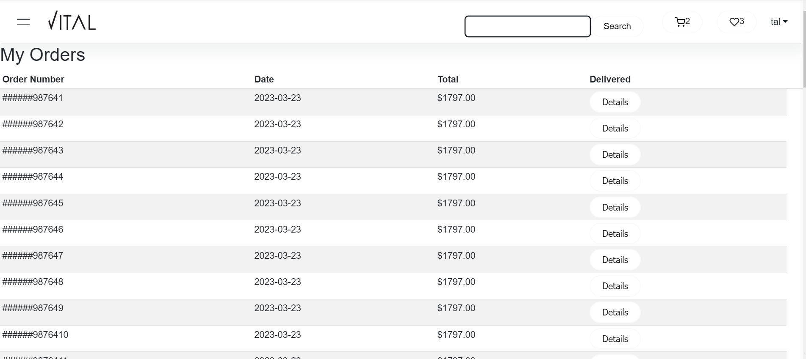
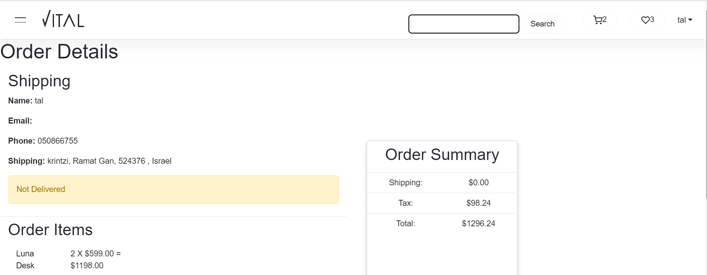

# Vital Furniture Store
 
Vital Furniture Store is a web application that allows users to browse and purchase furniture items. It is built using Django, React with Redux, and TypeScript.

# Getting Started
# `Installation`
To run the application locally, follow these steps:

Clone the repository:
Copy code
git clone https://github.com/yourusername/vital-furniture-store.git

 
Install the dependencies:
Copy code
cd back
pip install -r requirements.txt

cd frontend
npm i
npm start

 
Start the development server:
Copy code
python manage.py runserver

 
Open the application in your browser:
arduino
Copy code
http://localhost:8000

# `Requirements`
Node.js (v14.16.1 or later)
Yarn (v1.22.10 or later)
Python (v3.9.1 or later)
Django (v3.2.3 or later)
SQLite (v3.35.5 or later)

Contributing
If you would like to contribute to the project, please follow these steps:

License
This project is licensed under the MIT License - see the LICENSE.md file for details.

# Category Page

# Cart 

# Wishlist

# Shipping Page

# My Orders Page

# My Order Details

# Login/Register

# Register Form

# About Page

