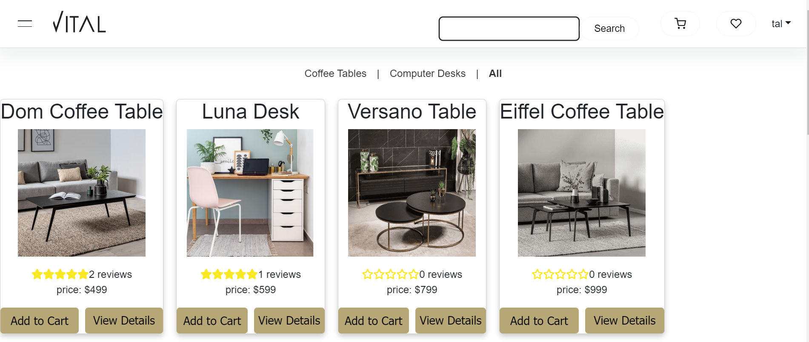

# Getting Started with Create React App

This project was bootstrapped with [Create React App](https://github.com/facebook/create-react-app), using the [Redux](https://redux.js.org/) and [Redux Toolkit](https://redux-toolkit.js.org/) TS template.

## Available Scripts

In the project directory, you can run:

### `npm start`

Runs the app in the development mode.\
Open [http://localhost:3000](http://localhost:3000) to view it in the browser.

The page will reload if you make edits.\
You will also see any lint errors in the console.

### `npm test`

Launches the test runner in the interactive watch mode.\
See the section about [running tests](https://facebook.github.io/create-react-app/docs/running-tests) for more information.

### `npm run build`

Builds the app for production to the `build` folder.\
It correctly bundles React in production mode and optimizes the build for the best performance.

The build is minified and the filenames include the hashes.\
Your app is ready to be deployed!

See the section about [deployment](https://facebook.github.io/create-react-app/docs/deployment) for more information.

### `npm run eject`

**Note: this is a one-way operation. Once you `eject`, you can’t go back!**

If you aren’t satisfied with the build tool and configuration choices, you can `eject` at any time. This command will remove the single build dependency from your project.

Instead, it will copy all the configuration files and the transitive dependencies (webpack, Babel, ESLint, etc) right into your project so you have full control over them. All of the commands except `eject` will still work, but they will point to the copied scripts so you can tweak them. At this point you’re on your own.

You don’t have to ever use `eject`. The curated feature set is suitable for small and middle deployments, and you shouldn’t feel obligated to use this feature. However we understand that this tool wouldn’t be useful if you couldn’t customize it when you are ready for it.

## Learn More

You can learn more in the [Create React App documentation](https://facebook.github.io/create-react-app/docs/getting-started).

To learn React, check out the [React documentation](https://reactjs.org/).

Vital Furniture Store
Vital Furniture Store is a web application that allows users to browse and purchase furniture items. It is built using Django, React with Redux, and TypeScript.

Installation
To run the application locally, follow these steps:

Clone the repository:
bash
Copy code
git clone https://github.com/yourusername/vital-furniture-store.git
Install the dependencies:
bash
Copy code
cd vital-furniture-store
pip install -r requirements.txt
cd frontend
npm install
Set up the database:
Copy code
python manage.py makemigrations
python manage.py migrate
Start the development server:
Copy code
python manage.py runserver
Open the application in your browser:
arduino
Copy code
http://localhost:8000
Features
Browse furniture items by category
Search for specific furniture items
Add items to a shopping cart
Checkout and place orders
Technologies Used
Django
React with Redux
TypeScript
HTML
CSS
Contributing
If you would like to contribute to the project, please follow these steps:

Fork the repository
Create a new branch for your feature: git checkout -b my-new-feature
Commit your changes: git commit -am 'Add some feature'
Push to the branch: git push origin my-new-feature
Submit a pull request
License
This project is licensed under the MIT License - see the LICENSE.md file for details.

